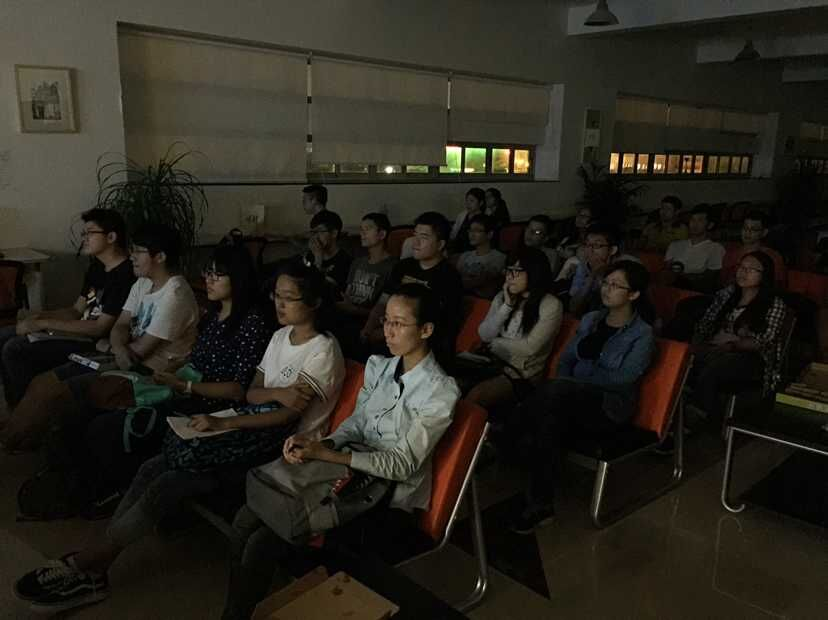
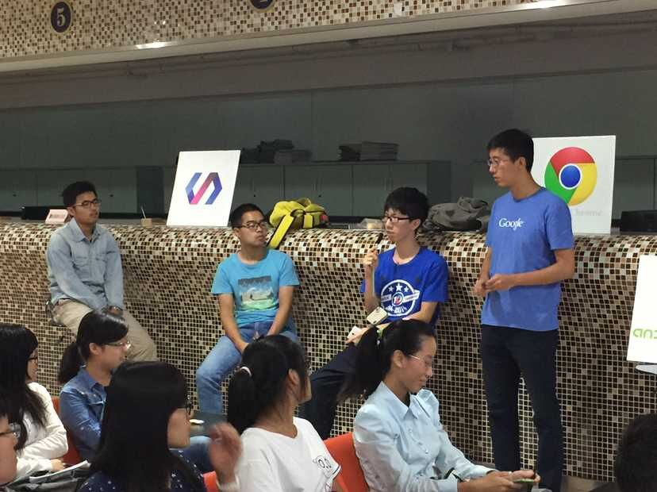
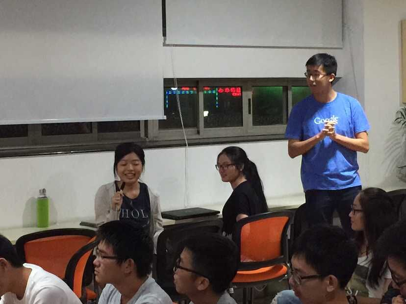
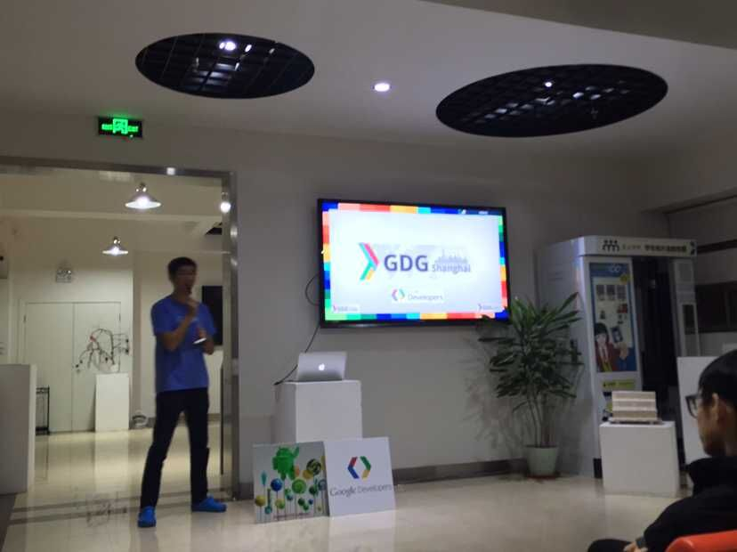

**活动时间：**2015年9月13日周日19:00-21:00

**活动地点：**上海大学宝山校区A400大厅

**活动人数：**40人

**活动照片：**
继之前与上海大学开源社区开展Android Fundamentals Study Jams的活动后，上海GDG再次来到上海大学。

晚上七点，上海大学开源社区的负责人Simon组织活动开始，首先安排大家对周围的同学进行了解熟悉，通过介绍自己身边的人的方式，了解大家平时喜欢的技术，认识身边的人。

随后由上海GDG的组织者Shaman为大家带来主题为《学习Google技术，不做井底之蛙》的分享。首先与大家一起观看了今年Google IO大会的视频，让大家接触到最新的Google技术。

Shaman请同学们分享自己所了解和正在使用的Google技术

Shaman向大家介绍上海GDG的发展与日常开展的活动

之后由上海大学开源社区的罗一凡同学给大家带来《React框架的使用经验》的分享，向大家介绍了react的基本特性和使用场景，告诉大家自己在使用react过程中遇到过的一些坑。

最后由上海大学开源社区的江瑜薇同学给大家带来《深入浅出Material Design》的分享，向大家介绍Google提出的设计规范Material Design的要点和demo演示。
