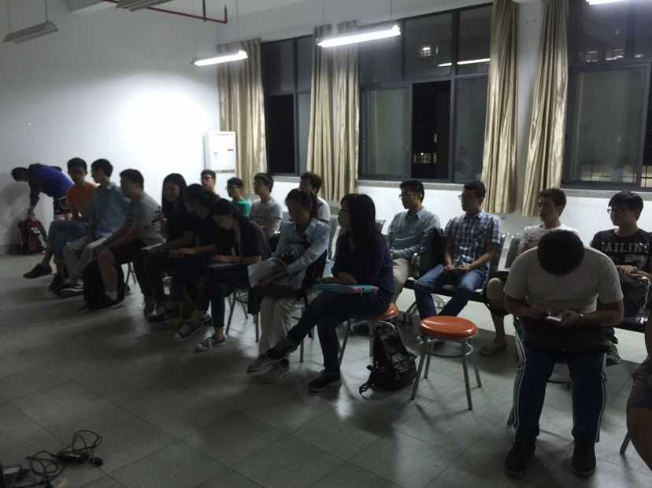
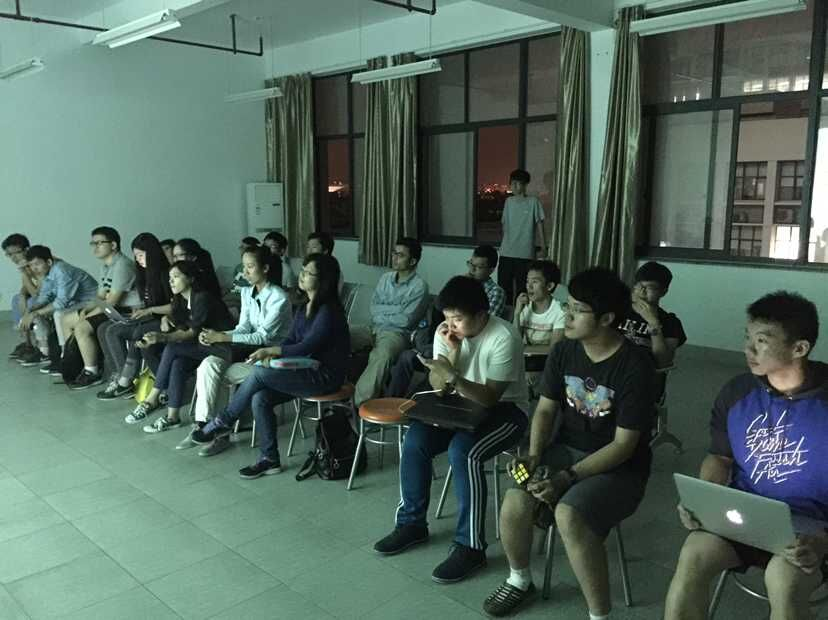
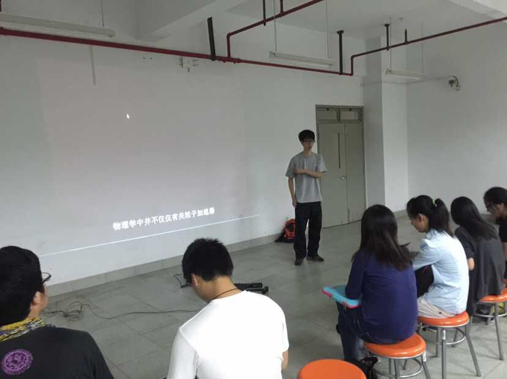
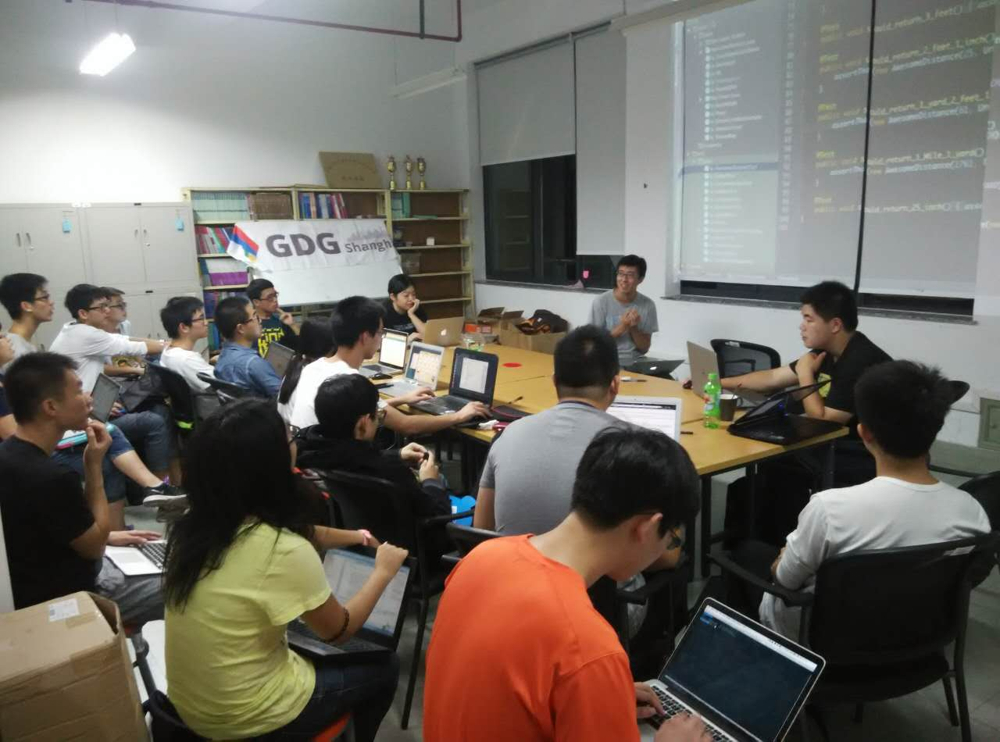
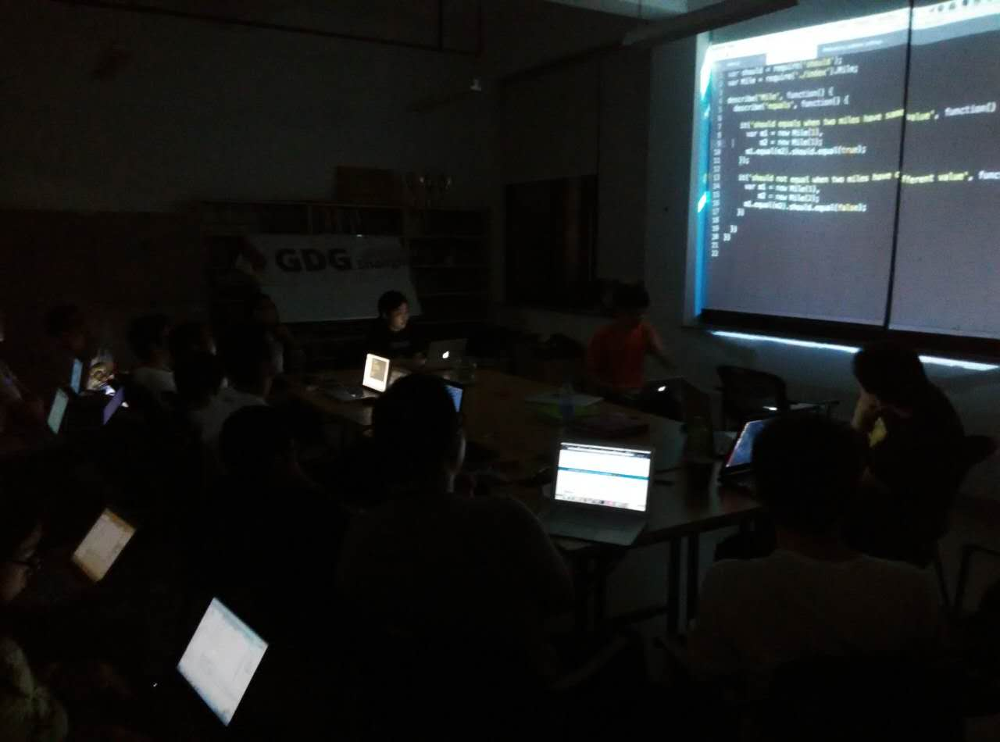

周三 SICP学习
---
**活动时间：**2015年9月16日 20:40开始

**活动地点：**上海大学宝山校区东区计算机大楼511

**活动人数：**20人

**活动照片：**

周日 单元测试
---
**活动时间：**2015年9月21日19:00-21:00

**活动地点：**上海大学宝山校区东区计算机大楼511

**活动人数：**20人

**活动内容：**GDG上海的组织者、资深java程序员Shaman给大家来分享单元测试的技巧

**活动照片：**

