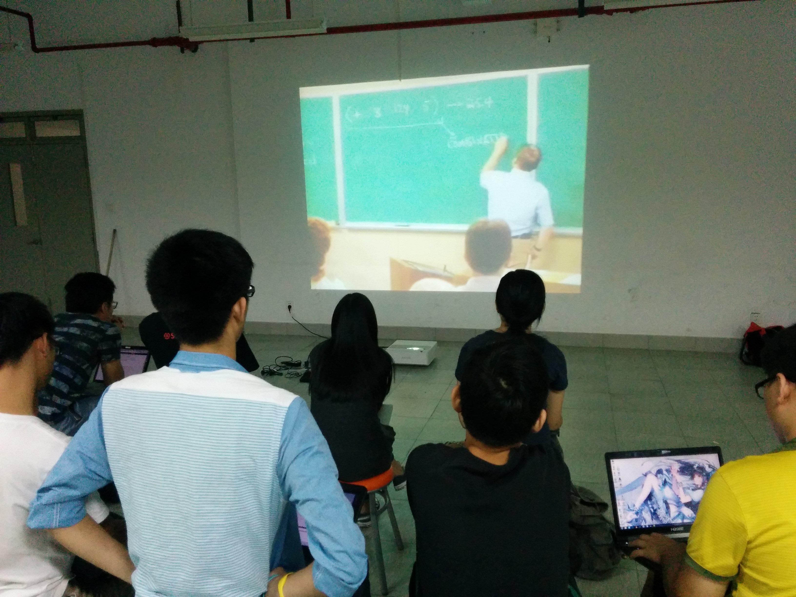

周三 SICP学习
---
**活动时间：**2015年9月23日 20:45

**活动地点：**上海大学宝山校区东区计算机大楼511

**活动人数：**10人

**活动内容：**
* 热身：用LISP写一个阶乘函数
* 视频教学
 - 基本元素是什么？
 - 如何将这些元素组合在一起(means of combination)
 - 抽象的方法，如何把他们封装成盒子

**活动照片：**

