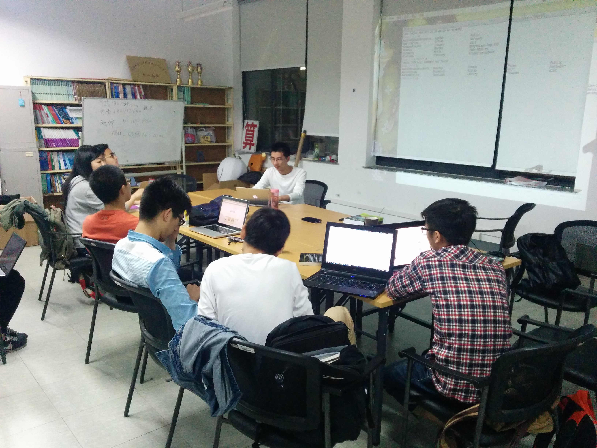
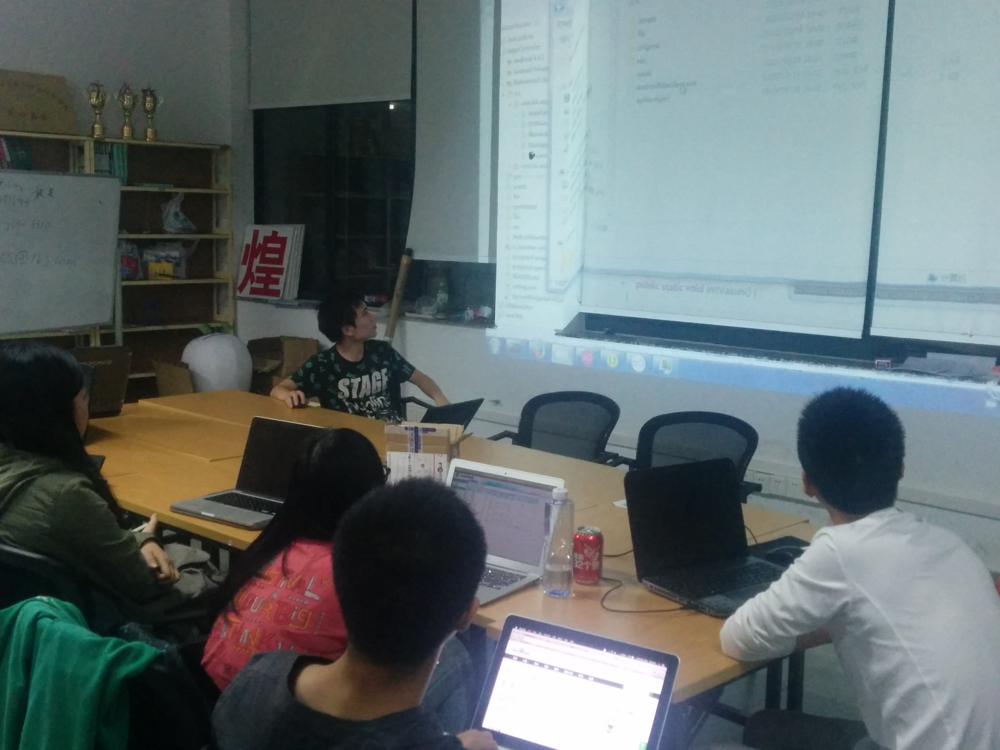

周三 SICP学习
---
**活动时间：**2015年10月14日 20:45

**活动地点：**上海大学宝山校区东区计算机大楼511

**活动人数：**10人

**活动内容：**
用高阶函数做抽象

1. 用lambda构造过程，用let构建局部变量
2. 过程作为一般性的方法
3. 过程作为返回值
4. 抽象和第一级过程

练习：区间折半法和牛顿法求函数不动点

周日 Android 反编入门
---
**活动时间：**2015年9月21日19:00-21:00

**活动地点：**上海大学宝山校区东区计算机大楼511

**活动人数：**

**活动嘉宾：**深藏功与名的骆兆楷学长

**活动照片：**

