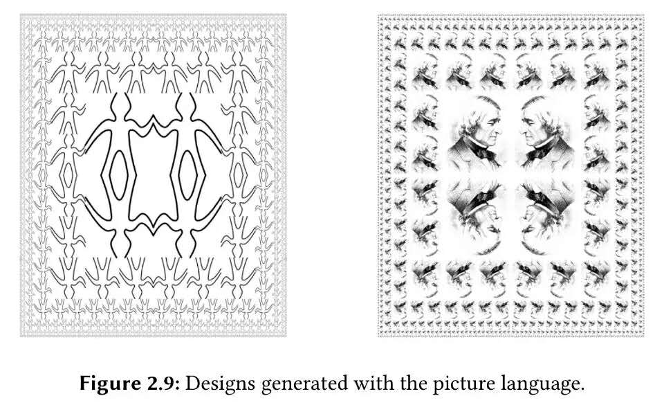

周三 SICP学习
---
**活动时间：**2015年12月9日 20:45

**活动地点：**上海大学宝山校区东区计算机大楼511

**主讲人：**郑旭铭

**活动内容：**
> * 复习回顾上学期的内容
> * 一个图形语言实例

> 本次将介绍一种用于画图形的简单语言，以展示数据抽象和闭包的威力，其中也以一种非常本质的方式使用了高阶过程。这一语言的设计就是为了很容易的做出一些模式。例如下图中所示的那类图形，他们就是由某些元素的重复出现而构成的。
> 
>这些元素可以变形或者改变大小。在这个语言中，数据元素的组合都用过程表示，而不是用表结构表示。就像cons满足一种闭包性质，使我们很容易构造出任意复杂的模式。
