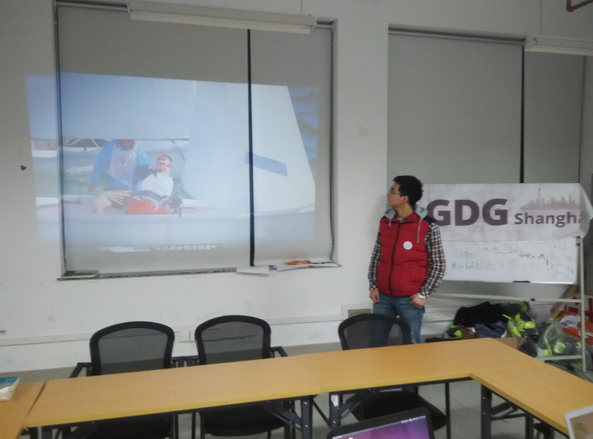

周三 SICP学习
---
**活动时间：**2015年12月16日 20:45

**活动地点：**上海大学宝山校区东区计算机大楼511

**主讲人：**郑旭铭

**活动内容：**
> **Lisp中的符号数据**
> * 到目前我们使用的所有复合数据，最终都是从数值出发构造起来的，这一次将引进人任意符号作为数据的功能来扩充所用语言的表述能力。
> * 实例：符号求导

> **抽象数据的多重表示**
> * 之前已经介绍过数据抽象和数据抽象屏障，这一次将学习如何去处理数据，去构造通用性过程使它们可能在一个程序的不同部分中采用不同的表示方式。

周日 GoogleAPI
---
**活动时间：**2015年12月20日晚19:00

**活动地点：**上海大学东区计算机大楼511

**活动主题**
> **Google - Year In Search 2015**

>The biggest moments of 2015 inspired trillions of questions. What do they reveal about us? Explore the full Year in Search!

> **Google API**
 - Google Developer Console
 - API Explorer
 - API Clent Library
 - demo

>API 是 Application Programming Interface 的缩写，亦即应用程序接口。众所周知，Google提供了相当丰富的服务，像Google Map、Youtube、Google Drive 以及 Google Calendar等，但這些服务通常需要连接Google网站才能使用，就像是大卖场有琳琅满目的商品，然而有沒有办法我們在家不出门就能订购所需要的物品，并让物品直接送到家里？此時 就需利用网购等方式 。为此 ， Google 就提供了各种简单可用性高的API，让我们能够在我们自己的应用上非常方便地接入Google的服务。

**活动照片**

